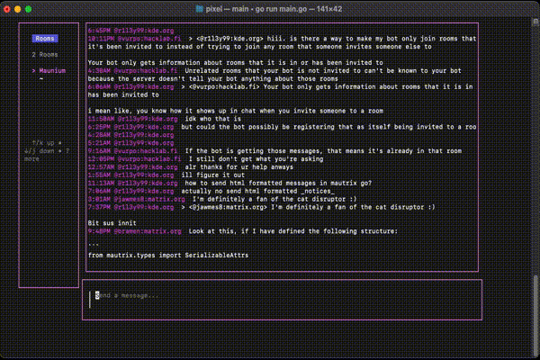

# pixel
Pixel is a Matrix client for the terminal built with [Bubble Tea](https://github.com/charmbracelet/bubbletea) and [mautrix-go](https://github.com/mautrix/go)



## How to Run
1. Set up an account on Matrix.org - (i.e., on [Element](https://app.element.io/#/login)) 
2. Clone this repo and set environment variables for your account credentials:
```
git clone https://github.com/jamesthesken/pixel.git

export PIXEL_HOMESERVER=matrix.org
export PIXEL_USERNAME=<your_username>
export PIXEL_PASSWORD=<your_password>
```
3. Build and go
```
go build
./pixel
```

## Usage

| Key                   | Description                                                |
| --------------------- | ---------------------------------------------------------- |
| <kbd>tab</kbd>        | Navigate between text input and room list                  |
| <kbd>down</kbd>       | Move up in the list of rooms                               |
| <kbd>up</kbd>         | Move down in the list of rooms                             |
| <kbd>enter</kbd>      | Send message to currently selected room                 |


## Contributing
You'll notice this project can't do much yet! If you want to contribute please feel free to start an issue or pull request.